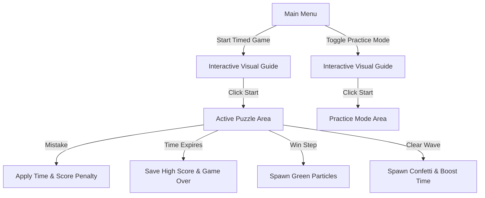

# Sort Pulse 🎮

**Sort Pulse** is an intense, timed arcade puzzle game and interactive algorithm trainer. Players race against the clock to sort randomized block grids using real-world sorting algorithms: **Selection Sort**, **Quick Sort**, and **Merge Sort**.

This repository contains the complete codebase, launch scripts, and persistent high score leaderboards for the game.

---

## 📸 Key Features

* **Three Unique Algorithm Modes:** Manually drive the step-by-step logic of Selection, Quick, and Merge Sort.
* **Practice Mode:** Train with zero timer pressure or penalty calculations.
* **Combo Multiplier System:** Stack consecutive correct moves to trigger score multipliers and pulsing visual indicators.
* **Juicy Particles & Confetti:** Vector physics particle bursts erupting on correct/incorrect actions, plus falling confetti cascades on wave completion.
* **Smooth Interpolated Animations:** Blocks glide dynamically when swapped, shifted, or split between layout levels.
* **Procedural Synth Soundtrack:** An 8-bit background chiptune track synthesized entirely in code at runtime. Melodic pacing speeds up dynamically under time pressure.
* **Local High Score Leaderboards:** Saves and displays top 5 runs for each algorithm mode locally in `sort_pulse_scores.txt`.
* **OS Native Launchers:** Single-click startup scripts (`run.bat` / `run.sh`) that auto-compile and run the game.

---

## 🧰 Prerequisites

To compile and run Sort Pulse, you need:

| Prerequisite | Recommended Version |
|---|---|
| **Java Development Kit (JDK)** | Version **21 or higher** |
| **OpenJFX (JavaFX SDK)** | Version **21 or higher** (e.g. 25.0.1) |

> **JavaFX SDK Download:** Get the appropriate SDK zip package for your OS from [Gluon OpenJFX](https://gluonhq.com/products/javafx/).

---

## 🚀 Easy Launch Setup

To run the game instantly, use the launch scripts in the root directory:

### 🪟 Windows (Batch Launcher)
1. Double-click `run.bat` or run it from command line:
   ```cmd
   run.bat
   ```
2. If it's your first run, the script will prompt you to input the absolute path to your JavaFX SDK folder (e.g., `C:\javafx-sdk-25.0.1`). It saves this to `javafx_path.txt` so future launches run automatically.

### 🐧 macOS / Linux (Shell Launcher)
1. Give execute permissions:
   ```bash
   chmod +x run.sh
   ```
2. Run the script:
   ```bash
   ./run.sh
   ```
3. Enter your JavaFX SDK path when prompted.

---

## 📖 Complete Game Manual & Documentation

### 🕹️ Game Flow & Modes



#### 1. Timed Blitz Mode
* You start with a limited clock (20s for Selection Sort, 40s for Quick/Merge Sort).
* Correct steps extend the timer (`+10s` for Selection/Quick, `+30s` for Merge Sort).
* Incorrect steps subtract `-3s` from the timer and deduct `-25 points`.
* The game ends when the timer hits zero.

#### 2. Practice Mode
* Enable this by checking the **PRACTICE MODE (NO TIMER)** box on the main menu.
* The timer displays **PRACTICE** and will not count down.
* All time and score penalties on incorrect actions are disabled, letting you learn at your own pace.

---

### 🧮 Score & Combo System
* **Correct Move:** Adds `10 × current combo` to your score.
* **Combo Count:** Increases by `1` with every correct move. When you have `2` or more consecutive correct moves, a pulsing **COMBO xN** banner is displayed.
* **Mistakes:** Resets the active combo counter back to `0`.
* **Wave Completion Score:**
  $$\text{Score Reward} = 100 + \max(0, \text{Timer} \times 10 - \text{Mistakes} \times 30)$$
  *Clear waves quickly and accurately to maximize speed bonuses.*

---

### ⌨️ Game Controls

| Key | Gameplay Action | Visual Guide Action |
|---|---|---|
| `A` / `←` | Move Selection Cursor Left | Navigate to Previous Slide |
| `D` / `→` | Move Selection Cursor Right | Navigate to Next Slide / Start Game |
| `ENTER` | Select / Execute Shift Action | Start Game (on final slide) |
| `ESC` | Return to Menu (retains fullscreen) | Close Tutorial Overlay |
| `R` | Restart Game (when Game Over) | — |

---

### 🎯 How to Play by Algorithm

#### 🟢 Selection Sort (Ascending)
* **Objective:** Find the smallest element in the unsorted portion of the array and move it to the front.
* **How to play:** Move the selection cursor to the **minimum** unsorted element (the active range is indicated by a dashed boundary box) and press `ENTER` to shift it to its correct sorted index.

#### 🟡 Quick Sort (Ascending - Lomuto Partition)
* **Objective:** Partition elements around a pivot.
* **How to play:**
  1. The rightmost element of the active range is marked as the **PIVOT** with an orange badge.
  2. A gold comparison badge (e.g., `<` or `>`) displays above the blocks showing the relation between the cursor block and the pivot.
  3. Scan each element from left to right: if the value is $\leq$ the pivot, press `ENTER` to shift it to the partition slot (indicated by the `TARGET SLOT` arrow).
  4. Once scanning is complete, press `ENTER` on the pivot to shift it to its final resolved index (where it locks green).

#### 🔵 Merge Sort (Double-Level Merging)
* **Objective:** Merge two pre-sorted subarrays into a single sorted output.
* **How to play:**
  1. Unmerged blocks sit on the **upper level** inside `SUBARRAY A` and `SUBARRAY B` dashed frames.
  2. The next merge slot is indicated by the `TARGET SLOT` pointer arrow on the **lower level**.
  3. Compare the **HEAD** element of Subarray A and Subarray B (indicated by cyan badges).
  4. Press `ENTER` on the smaller of the two HEAD elements to merge it down into the output area.
  5. Repeat until all elements are merged and locked (green).

---

## 🏗️ Technical Architecture Overview

Sort Pulse utilizes a single-file, highly modular **Model-View-Controller (MVC)** architecture inside `ChromaCascadeApp.java`:

* **Model (`ChromaCascadeModel`):** Manages raw game states, active puzzle grids, pre-computed algorithm step traces, timers, combos, score values, and practice toggles.
* **View (`ChromaCascadeView`):** Draws the UI onto a JavaFX 2D `Canvas` using a rendering loop. Handles:
  * **Visual coordinate mapping maps (`visualXMap`, `visualYMap`)** to interpolate coordinates at $22\%$ velocity per frame, achieving smooth block slide animations.
  * **Particle Engine** which simulates and draws active physics particle vectors.
* **Controller (`ChromaCascadeController`):** Listens to keyboard inputs, evaluates player actions against pre-computed algorithm traces, generates new randomized waves, and manages state transitions.
* **Audio (`SoundManager`):** Generates retro synthesizer tones using standard Java audio APIs (`javax.sound.sampled`). Runs a background **daemon music thread** generating an arpeggiated bassline progression that scales tempo dynamically based on the model's timer.

---

## 🛠️ Developer Customization Guide

If you want to modify parameters or customize the game engine, edit these values in `app/ChromaCascadeApp.java`:

### 📏 Wave Sizes and Grid Lengths
In `ChromaCascadeController.spawnNewPuzzleSet()` (around line 1400):
```java
int length = Math.min(12, 8 + completed / 4);
```
* **8:** Starting block length of waves.
* **12:** Maximum ceiling block length.
* Change these to increase or decrease puzzle difficulty as the player progresses.

### ⏱️ Initial Mode Countdown Times
In `ChromaCascadeController.initializeGame()` (around line 1280):
```java
int startingTime = model.getTargetAlgorithm().equalsIgnoreCase("Selection Sort") ? 20 : 40;
```
* Modify `20` (Selection Sort) or `40` (Quick/Merge Sort) to tighten or loosen start timers.

### 🎵 Background Music Progression
In `SoundManager.startMusic()` (around line 140):
```java
int[][] progressions = {
    {220, 261, 329, 261}, // Am (A2, C3, E3, C3)
    {196, 246, 293, 246}, // G (G2, B2, D3, B2)
    {174, 220, 261, 220}, // F (F2, A2, C3, A2)
    {164, 207, 246, 207}  // E (E2, G#2, B2, G#2)
};
```
* Change these integer frequencies (Hz) to define custom retro chord progression melodies.

---

## 📄 License

This project is for educational and training purposes. Feel free to modify, build upon, or distribute it.
